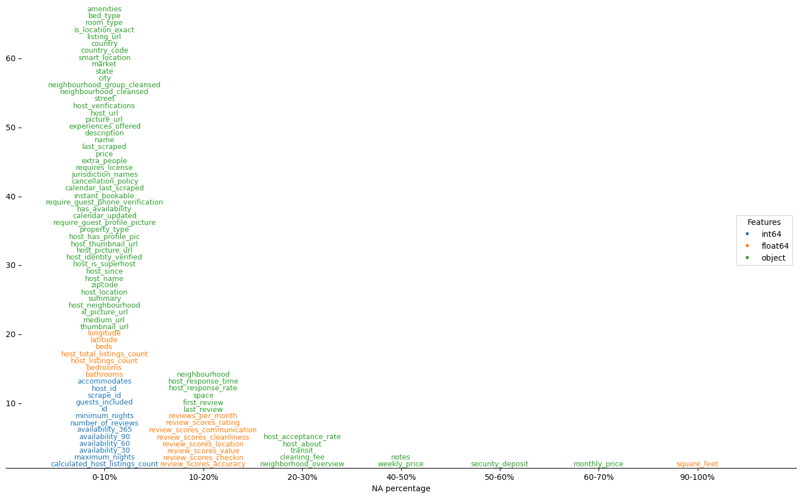

# nafig

<div align="center">

[](https://github.com/VladimirShitov/nafig/actions?query=workflow%3Abuild)
[](https://pypi.org/project/nafig/)
[](https://github.com/VladimirShitov/nafig/pulls?utf8=%E2%9C%93&q=is%3Apr%20author%3Aapp%2Fdependabot)

[](https://github.com/psf/black)
[](https://github.com/PyCQA/bandit)
[](https://github.com/VladimirShitov/nafig/blob/master/.pre-commit-config.yaml)
[](https://github.com/VladimirShitov/nafig/releases)
[](https://github.com/VladimirShitov/nafig/blob/master/LICENSE)


Do you want to visualize missing values in your data? There are plenty amazing methods (check [missingno](https://github.com/ResidentMario/missingno) for example) but they all look bulky when your data has too many columns. `nafig` will help you to build a perfect NA figure!

</div>

# Installation

```bash
$ pip install -U nafig
```

or install with `Poetry`

```bash
$ poetry add nafig
```

# Usage

Here are some examples of the usage both for simulated and real world data. Check [this notebook](example.ipynb) to play with code yourself!

First, let's import the core function and other useful things:

```python
>>> from nafig.plots import na_text_barplot  # The core function
>>> from nafig.utils import create_example_data  # To simulate data
>>> import pandas as pd  # To works with tables
```

```python
>>> df, feature_types = create_example_data()
```

`df` is just a pandas dataframe with missing values. `feature_types` is an array, containing data type description for each column. This is just an example, so labels don't correspond to actual data types.

```python
>>> feature_types[:10]
array(['Categorical', 'Categorical', 'Binary', 'Continuous', 'Continuous',
       'Continuous', 'Binary', 'Continuous', 'Continuous', 'Binary'],
      dtype='<U11')
```

This toy dataframe contains 300 columns. Visualization of missing data with heatmap would unfortunately be too bulky. How to explore missing data distribution in this dataset? Try NA text barplot!

```python
>>> na_text_barplot(df, hue=feature_types, line_height=1.5)
```


Columns of the dataset are binned by percentage of the missing data in them. Colouring by feature types helps to understand, which types of data are missing. On Y-axis you can see the number of features in each group.

You can vary the number of bins using num_bins parameter:

```python
>>> na_text_barplot(df, hue=feature_types, line_height=1.5, num_bins=20)
```


```python
>>> na_text_barplot(df, hue=feature_types, line_height=2, num_bins=2, fig_width=8, font_size=3)
```


Now let's see some real data examples!

## House prices missing data visualization

Data source: https://www.kaggle.com/c/house-prices-advanced-regression-techniques/data?select=train.csv

```python
>>> DATA_PATH = "data/house-prices/train.csv"
>>> house_prices_df = pd.read_csv(DATA_PATH, index_col=0)
```

This is a reasonably good data with most of the values present. But thanks to this plot, we can see, which features are the bad guys!

```python
>>> na_text_barplot(house_prices_df, fig_width=17, num_bins=20, line_height=1.5)
```


Note that if you don't pass the `hue` parameter, features will be colored by the data type of the column. If you don't want to colorize features at all, set `hue` to `False`.

By setting `remove_empty_bins` to `True`, you can remove the empty bins. It will require a reader to pay more attention to the X-axis but will save you some space.

```python
>>> na_text_barplot(house_prices_df, fig_width=10, num_bins=20, 
                    line_height=1.5, remove_empty_bins=True)
```


## Seatle AirBnB dataset missing values vizualization

Data source: https://www.kaggle.com/datasets/airbnb/seattle

```python
>>> airbnb_df = pd.read_csv("data/airbnb/listings.csv")
```

This dataset has a bit more missing data. On the plot we can see that all integer features are almost complete, and some `object` and floating number columns contain missing values

```python
>>> na_text_barplot(airbnb_df, fig_width=18, line_height=1.8, font_size=9, remove_empty_bins=True)
```



Feel free to explore other parameters! There are more to help you create a perfect missing values visualization

# Developers section

## 🚀 Features

### Development features

- Supports for `Python 3.9` and higher.
- [`Poetry`](https://python-poetry.org/) as the dependencies manager. See configuration in [`pyproject.toml`](https://github.com/VladimirShitov/nafig/blob/master/pyproject.toml) and [`setup.cfg`](https://github.com/VladimirShitov/nafig/blob/master/setup.cfg).
- Automatic codestyle with [`black`](https://github.com/psf/black), [`isort`](https://github.com/timothycrosley/isort) and [`pyupgrade`](https://github.com/asottile/pyupgrade).
- Ready-to-use [`pre-commit`](https://pre-commit.com/) hooks with code-formatting.
- Type checks with [`mypy`](https://mypy.readthedocs.io); docstring checks with [`darglint`](https://github.com/terrencepreilly/darglint); security checks with [`safety`](https://github.com/pyupio/safety) and [`bandit`](https://github.com/PyCQA/bandit)
- Testing with [`pytest`](https://docs.pytest.org/en/latest/).
- Ready-to-use [`.editorconfig`](https://github.com/VladimirShitov/nafig/blob/master/.editorconfig), [`.dockerignore`](https://github.com/VladimirShitov/nafig/blob/master/.dockerignore), and [`.gitignore`](https://github.com/VladimirShitov/nafig/blob/master/.gitignore). You don't have to worry about those things.

### Deployment features

- `GitHub` integration: issue and pr templates.
- `Github Actions` with predefined [build workflow](https://github.com/VladimirShitov/nafig/blob/master/.github/workflows/build.yml) as the default CI/CD.
- Everything is already set up for security checks, codestyle checks, code formatting, testing, linting, docker builds, etc with [`Makefile`](https://github.com/VladimirShitov/nafig/blob/master/Makefile#L89). More details in [makefile-usage](#makefile-usage).
- [Dockerfile](https://github.com/VladimirShitov/nafig/blob/master/docker/Dockerfile) for your package.
- Always up-to-date dependencies with [`@dependabot`](https://dependabot.com/). You will only [enable it](https://docs.github.com/en/github/administering-a-repository/enabling-and-disabling-version-updates#enabling-github-dependabot-version-updates).
- Automatic drafts of new releases with [`Release Drafter`](https://github.com/marketplace/actions/release-drafter). You may see the list of labels in [`release-drafter.yml`](https://github.com/VladimirShitov/nafig/blob/master/.github/release-drafter.yml). Works perfectly with [Semantic Versions](https://semver.org/) specification.


### Makefile usage

[`Makefile`](https://github.com/VladimirShitov/nafig/blob/master/Makefile) contains a lot of functions for faster development.

<details>
<summary>1. Download and remove Poetry</summary>
<p>

To download and install Poetry run:

```bash
make poetry-download
```

To uninstall

```bash
make poetry-remove
```

</p>
</details>

<details>
<summary>2. Install all dependencies and pre-commit hooks</summary>
<p>

Install requirements:

```bash
make install
```

Pre-commit hooks coulb be installed after `git init` via

```bash
make pre-commit-install
```

</p>
</details>

<details>
<summary>3. Codestyle</summary>
<p>

Automatic formatting uses `pyupgrade`, `isort` and `black`.

```bash
make codestyle

# or use synonym
make formatting
```

Codestyle checks only, without rewriting files:

```bash
make check-codestyle
```

> Note: `check-codestyle` uses `isort`, `black` and `darglint` library

Update all dev libraries to the latest version using one comand

```bash
make update-dev-deps
```

<details>
<summary>4. Code security</summary>
<p>

```bash
make check-safety
```

This command launches `Poetry` integrity checks as well as identifies security issues with `Safety` and `Bandit`.

```bash
make check-safety
```

</p>
</details>

</p>
</details>

<details>
<summary>5. Type checks</summary>
<p>

Run `mypy` static type checker

```bash
make mypy
```

</p>
</details>

<details>
<summary>6. Tests with coverage badges</summary>
<p>

Run `pytest`

```bash
make test
```

</p>
</details>

<details>
<summary>7. All linters</summary>
<p>

Of course there is a command to ~~rule~~ run all linters in one:

```bash
make lint
```

the same as:

```bash
make test && make check-codestyle && make mypy && make check-safety
```

</p>
</details>

<details>
<summary>8. Docker</summary>
<p>

```bash
make docker-build
```

which is equivalent to:

```bash
make docker-build VERSION=latest
```

Remove docker image with

```bash
make docker-remove
```

More information [about docker](https://github.com/VladimirShitov/nafig/tree/master/docker).

</p>
</details>

<details>
<summary>9. Cleanup</summary>
<p>
Delete pycache files

```bash
make pycache-remove
```

Remove package build

```bash
make build-remove
```

Delete .DS_STORE files

```bash
make dsstore-remove
```

Remove .mypycache

```bash
make mypycache-remove
```

Or to remove all above run:

```bash
make cleanup
```

</p>
</details>

## 📈 Releases

You can see the list of available releases on the [GitHub Releases](https://github.com/VladimirShitov/nafig/releases) page.

We follow [Semantic Versions](https://semver.org/) specification.

We use [`Release Drafter`](https://github.com/marketplace/actions/release-drafter). As pull requests are merged, a draft release is kept up-to-date listing the changes, ready to publish when you’re ready. With the categories option, you can categorize pull requests in release notes using labels.

### List of labels and corresponding titles

|               **Label**               |  **Title in Releases**  |
| :-----------------------------------: | :---------------------: |
|       `enhancement`, `feature`        |       🚀 Features       |
| `bug`, `refactoring`, `bugfix`, `fix` | 🔧 Fixes & Refactoring  |
|       `build`, `ci`, `testing`        | 📦 Build System & CI/CD |
|              `breaking`               |   💥 Breaking Changes   |
|            `documentation`            |    📝 Documentation     |
|            `dependencies`             | ⬆️ Dependencies updates |

You can update it in [`release-drafter.yml`](https://github.com/VladimirShitov/nafig/blob/master/.github/release-drafter.yml).

GitHub creates the `bug`, `enhancement`, and `documentation` labels for you. Dependabot creates the `dependencies` label. Create the remaining labels on the Issues tab of your GitHub repository, when you need them.

## 🛡 License

[](https://github.com/VladimirShitov/nafig/blob/master/LICENSE)

This project is licensed under the terms of the `MIT` license. See [LICENSE](https://github.com/VladimirShitov/nafig/blob/master/LICENSE) for more details.

## 📃 Citation

```bibtex
@misc{nafig,
  author = {VladimirShitov},
  title = {Package for plotting figures with NA data distribution},
  year = {2023},
  publisher = {GitHub},
  journal = {GitHub repository},
  howpublished = {\url{https://github.com/VladimirShitov/nafig}}
}
```

## Credits [](https://github.com/TezRomacH/python-package-template)

This project was generated with [`python-package-template`](https://github.com/TezRomacH/python-package-template)
